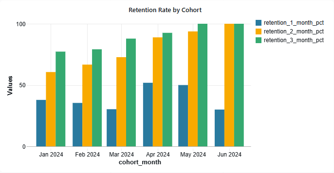
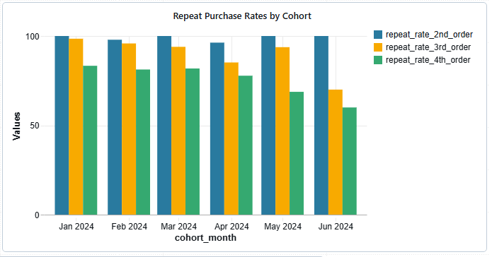
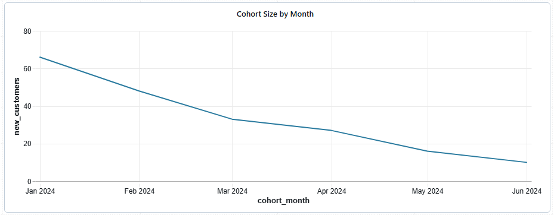

# 📊 Detailed Analysis and Conclusions

This document provides a deep dive into the cohort analysis results, interprets the key visualizations, and suggests actionable next steps.

## 1. Retention Rate by Cohort

This chart shows the percentage of customers from each cohort who placed a second order within 1, 2, and 3 months after their first purchase.

### Findings

* **High Long-Term Retention:** The **January 2024** and **February 2024** cohorts demonstrate strong 3-month retention (around 80%). The **March, April, and May 2024** cohorts show exceptional long-term retention, approaching or reaching 100%.
* **Variable Short-Term Retention:** There is a significant improvement in 2-month retention for cohorts from March to May 2024 compared to earlier cohorts.
* **Areas for Investigation:** The **March 2024** and **June 2024** cohorts exhibit the lowest 1-month retention rates (below 25%), which warrants further investigation. This drop contrasts with the improvements seen in April and May.
* **Impact of Cohort Size:** It's important to consider that the extremely high retention rates (near 100%) for some later cohorts might be influenced by their **small size**, which could skew the percentages.

---

## 2. Repeat Purchase Rates by Cohort

This chart shows the percentage of customers who placed at least a 2nd, 3rd, and 4th order.

### Findings

* **Strong Initial Repurchase:** All cohorts show a consistently high percentage of customers making at least a second purchase (`repeat_rate_2nd_order`), typically around 95-100%. This indicates a successful initial re-engagement with new customers.
* **Natural Attrition:** As expected, the percentage of customers making a 3rd and 4th purchase gradually decreases. This reflects a natural customer drop-off at each subsequent purchase level.
* **Overall Stability:** The repeat purchase rates for the 2nd order remain highly stable across all cohorts, suggesting the core product value proposition is strong for returning customers.

---

## 3. Cohort Size by Month

This chart shows the number of new customers (by their first purchase month) in each cohort.

### Findings

* **Largest Cohort:** The largest group of new customers was acquired in **January 2024** (~66 customers).
* **Decreasing Trend:** There is a **consistent and significant decline** in the number of new customers acquired from January to June 2024.
* **Business Implication:** This chart clearly indicates a **negative trend in new customer acquisition**. This is a critical issue that directly impacts long-term growth and requires immediate attention.

---

##  actionable Next Steps

Based on the analysis, the following actions are recommended:

1.  **Investigate Declining Cohort Size:** Prioritize analyzing the reasons behind the sharp decrease in new customer acquisition. Examine marketing channels, campaign performance, seasonality, and competitive landscape.
2.  **Deep Dive into Low 1-Month Retention:** For the March and June cohorts, analyze the characteristics of these customers. Were they acquired from a different channel? Did they buy a specific type of product? This could reveal issues with the onboarding experience.
3.  **Validate 100% Retention:** For recent cohorts with near-perfect retention, continue monitoring their behavior to confirm if these high rates are sustainable or simply an artifact of small cohort sizes and recent data.
4.  **Optimize for 3rd and 4th Purchases:** Since the 2nd purchase rate is high, focus on strategies to encourage 3rd and 4th purchases. This could involve targeted promotions, loyalty programs, or personalized communication after the second purchase.
5.  **Establish Continuous Monitoring:** Implement these dashboards as a regular report to continuously track cohort performance, measure the impact of any changes, and identify new trends early.
